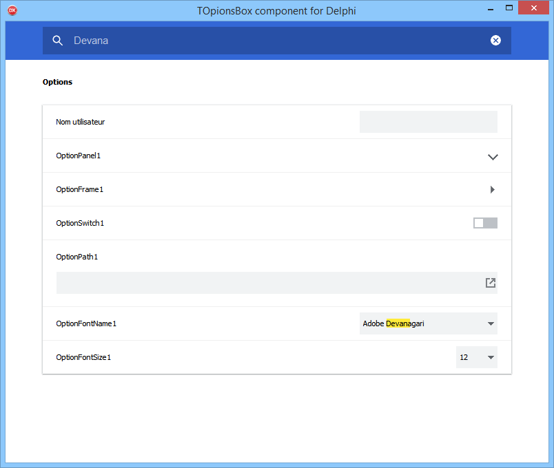

# OptionsBox
Delphi component like the Chrome parameters screen

(c)2019 by [Execute SARL](http://www.execute.fr)

This repository contains a demo version with Rio compatible DCU, the component will display a "DEMO VERSION" mention randomly on the component.

the dcu.12 directory contains Delphi 12 compatible DCU

For the full source code compatible at least with Delphi XE3 to Delphi 12, you have to buy it on [my store](https://store.execute.fr)

